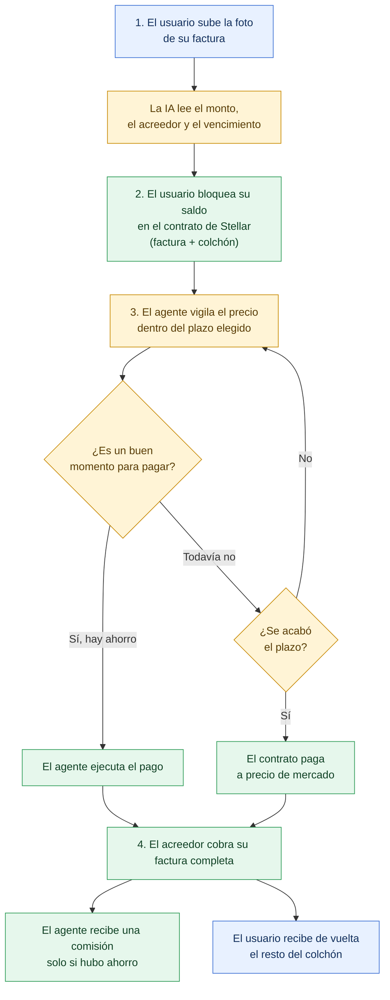
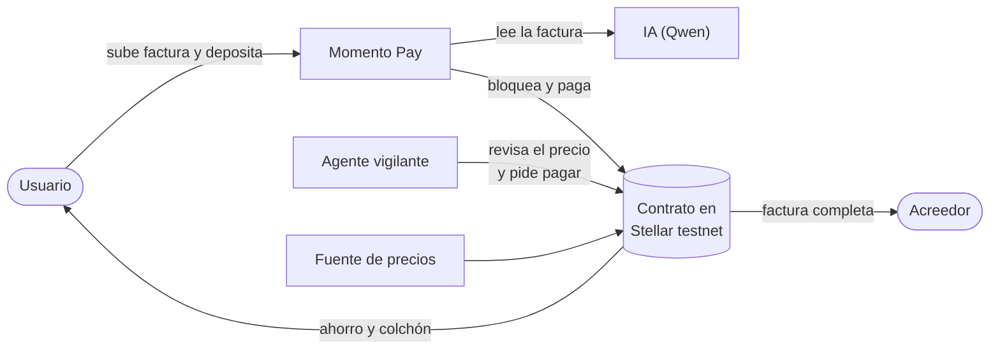

# Momento Pay

**Tu factura siempre se paga. Tú ganas el momento.**

Momento Pay es un asistente de pagos con inteligencia artificial que paga tus facturas en el mejor momento posible, sin poner nunca en riesgo el dinero de la factura. Funciona sobre la red Stellar.

> Proyecto de **Stellar Odyssey Perú 2026** · Track 1: AI Agents & Automated Workflows
> Todo el proyecto corre en **testnet**: no usa dinero real ni promete rendimientos.

---

## ¿Qué problema resuelve?

En Perú, mucha gente y muchas pymes guardan ahorros en dólares digitales, pero sus facturas, deudas o compras a proveedores están en soles. La costumbre es pagar el mismo día que llega la cuenta.

Eso tiene dos problemas:

1. **Se pierde plata sin darse cuenta.** El tipo de cambio y los descuentos por pronto pago cambian con los días. Pagar sin mirar puede costar más de lo necesario.
2. **Nadie confía en que un robot maneje su dinero.** Dejar que una IA decida cuándo pagar da miedo: ¿y si se equivoca y la factura no se paga?

## La solución

Momento Pay resuelve ambos problemas con una idea simple:

> **La factura está protegida. Solo el colchón se optimiza.**

Si tienes 300 dólares y una factura de 250, esos 250 quedan bloqueados y garantizados para el acreedor. El agente solo trabaja con los 50 de colchón: busca el momento en que pagar te cueste menos, dentro de un plazo que tú eliges (1 día, 1 semana o 2 semanas) y **siempre antes del vencimiento**.

Si aparece un buen momento, el agente paga y **el ahorro queda para ti**. Si no aparece, al terminar el plazo el sistema paga igual. La factura nunca queda sin pagar.

## Beneficios

**Para el usuario**
- Ahorra en cada pago sin tener que vigilar el tipo de cambio.
- Duerme tranquilo: la factura está garantizada por un contrato, no por la buena voluntad de un robot.
- Puede pagar de inmediato en cualquier momento, si prefiere no esperar.

**Para quien cobra (pyme, proveedor, amigo)**
- Recibe el pago completo y a tiempo, siempre antes del vencimiento.
- Sabe de antemano que el dinero ya está bloqueado.

**Para el ecosistema**
- Muestra una forma segura de delegar dinero a agentes de IA: el agente decide *cuándo*, pero nunca puede llevarse el dinero.
- Usa Stellar, donde las comisiones de red son mínimas y permiten que el agente revise el precio con frecuencia.

## ¿Cómo funciona?

1. **Subes tu factura.** Una IA lee la foto y extrae el monto, quién cobra y la fecha de vencimiento.
2. **Bloqueas tu saldo.** Depositas el monto de la factura más un colchón en un contrato inteligente. Eliges cuánto tiempo puede esperar el agente.
3. **El agente vigila.** Revisa el precio cada cierto tiempo. Solo puede pagar si hacerlo no te sale peor que pagar el primer día.
4. **Se paga y se reparte.** El acreedor cobra su factura completa, el agente recibe una pequeña comisión solo si hubo ahorro, y **el resto vuelve a tu billetera**.

Además, la IA te explica en español por qué esperó o por qué pagó ("esperé porque el precio mejoró 0.4%"), para que siempre entiendas qué hizo el agente.

### Ejemplo ilustrativo

| | |
|---|---|
| Saldo del usuario | 300 USDC |
| Factura (equivale a) | 250 USDC |
| Colchón | 50 USDC |
| Si el precio mejora 1% durante la espera | La factura cuesta ~247.5 USDC |
| Ahorro para el usuario | ~2.5 USDC (menos la comisión del agente) |

Los números son solo un ejemplo. El ahorro depende del mercado, es variable y **puede ser cero**. En ese caso, la factura se paga igual.

## Diagrama general

Azul: acciones del usuario · Amarillo: inteligencia artificial · Verde: contrato en Stellar

## Quién hace qué

## Cómo usa Stellar

- Un **contrato inteligente** (Soroban) guarda el saldo bloqueado y aplica las reglas: solo paga al acreedor indicado, nunca después del vencimiento y nunca por debajo de lo acordado.
- El agente tiene **permisos limitados**: puede pedir el pago, pero no puede mover el dinero a ningún otro lugar.
- Cada pago queda registrado en la red, así que cualquiera puede verificar qué pasó.
- El usuario firma con su billetera **Freighter**.

## Evidencia en Stellar testnet

| Elemento | Valor |
|---|---|
| ID del contrato | `[ ]` |
| Transacción de creación de factura | `[ ]` |
| Transacción de pago | `[ ]` |

## Límites que declaramos

- **Solo testnet.** No se usa dinero real de terceros.
- **Sin promesa de rendimiento.** El ahorro es variable y no está garantizado; Momento Pay es un optimizador de pagos, no una inversión.
- **Retiro a Yape o débito:** no existe en testnet. Se propone como siguiente paso, mediante un partner regulado.
- **Riesgo residual:** si el precio se mueve mucho más allá del colchón antes de que se active el límite de pérdida, el pago podría quedar corto. Se reduce con el colchón mínimo y el límite de pérdida, pero no desaparece.

## Próximos pasos

1. Descuentos por pronto pago definidos por el proveedor.
2. Retiro del ahorro a Yape o cuenta bancaria.
3. Pagos entre pymes y sus proveedores.
4. Postulación a programas de financiamiento del ecosistema.

## Tecnologías y créditos

`[ ] Completar con licencia y versión de cada uno`

- Stellar y Soroban (contratos en Rust)
- Qwen, de Alibaba Cloud (lectura de facturas y explicaciones) ( Por el momento , aun viendo otras opciones)
- Freighter (billetera)

## Equipo

| Nombre | GitHub | Rol |
|---|---|---|
| `[ RICHARD ESTEBAN]` | `[https://github.com/RichardEsteban ]` | `[ CEO]` |

## Licencia

MIT. Ver [LICENSE](LICENSE).
