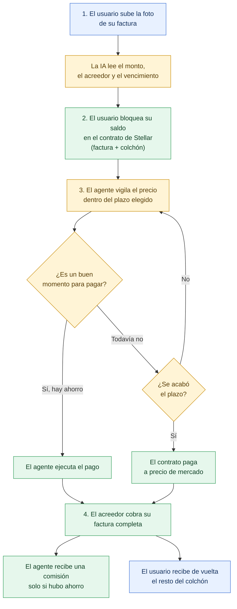
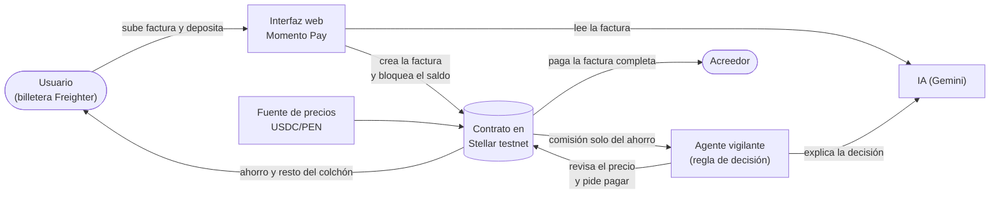

# Momento Pay

**Tu factura siempre se paga. Tú ganas el momento.**

Momento Pay es un asistente de pagos con inteligencia artificial que paga tus facturas en el mejor momento posible, sin poner nunca en riesgo el dinero de la factura. Funciona sobre la red Stellar.

> Proyecto de **Stellar Odyssey Perú 2026** · Track 1: AI Agents & Automated Workflows
> Todo el proyecto corre en **testnet**: no usa dinero real ni promete rendimientos.

Estado: en desarrollo durante la semana del hackathon. Ver [PHASES.md](PHASES.md) para el plan de trabajo y [CHANGELOG.md](CHANGELOG.md) para el avance.

---

## ¿Qué problema resuelve?

En Perú, mucha gente y muchas pymes guardan ahorros en dólares digitales, pero sus facturas, deudas o compras a proveedores están en soles. La costumbre es pagar el mismo día que llega la cuenta.

Eso tiene dos problemas:

1. **Se pierde plata sin darse cuenta.** El tipo de cambio y los descuentos por pronto pago cambian con los días. Pagar sin mirar puede costar más de lo necesario.
2. **Nadie confía en que un robot maneje su dinero.** Dejar que una IA decida cuándo pagar da miedo: ¿y si se equivoca y la factura no se paga?

## La solución

Momento Pay resuelve ambos problemas con una idea simple:

> **La factura está protegida. Solo el colchón se optimiza.**

Si tienes 300 dólares y una factura de 250, esos 250 quedan bloqueados y garantizados para el acreedor. El agente solo trabaja con los 50 de colchón: busca el momento en que pagar te cueste menos, dentro de un plazo que tú eliges (1 día, 1 semana o 2 semanas) y **siempre antes del vencimiento**.

Si aparece un buen momento, el agente paga y **el ahorro queda para ti**. Si no aparece, al terminar el plazo el sistema paga igual, al precio de ese día, que puede ser mejor o peor que el de hoy. La factura nunca queda sin pagar; lo que varía es cuánto te sobra del colchón.

## Beneficios

**Para el usuario**
- Un agente vigila el tipo de cambio por ti y paga cuando el ahorro alcanza lo que definiste, sin que tengas que mirarlo.
- Duerme tranquilo: la factura está garantizada por un contrato, no por la buena voluntad de un robot.
- Puede pagar de inmediato en cualquier momento, si prefiere no esperar.

**Para quien cobra (pyme, proveedor, amigo)**
- Recibe el pago completo y a tiempo, siempre antes del vencimiento.
- Sabe de antemano que el dinero ya está bloqueado.

**Para el ecosistema**
- Muestra una forma segura de delegar dinero a agentes de IA: el agente decide *cuándo*, pero nunca puede llevarse el dinero.
- Usa Stellar, donde las comisiones de red son mínimas y permiten que el agente revise el precio con frecuencia.

## Qué aporta hoy y qué no

- **Aporta:** delegar el momento del pago a un agente **sin arriesgar la factura** (los fondos están bloqueados y solo pueden ir al acreedor), un **plan claro y explicado en español** de cada decisión, **protección** (si el precio empeora demasiado se paga de inmediato) y una **auditoría** verificable en la red.
- **No aporta por sí solo:** un ahorro esperado. Con un tipo de cambio que se mueve al azar, esperar reparte el resultado entre mejores y peores casos (lo muestra el simulador). El ahorro previsible vendría de descuentos por pronto pago del proveedor o de mejor ejecución de rutas de pago, que están en los próximos pasos.
- **Precio real como referencia:** el oráculo de testnet es simulado, pero el comando `npm run cli -- sync-price` lo alimenta con el tipo de cambio real USD/PEN (fuente pública open.er-api.com), así que la demo parte de un valor de mercado real.

## ¿Cómo funciona?

1. **Subes tu factura.** Una IA lee la foto y extrae el monto, quién cobra y la fecha de vencimiento.
2. **Bloqueas tu saldo.** Depositas el monto de la factura más un colchón en un contrato inteligente. Eliges cuánto tiempo puede esperar el agente.
3. **El agente vigila.** Revisa el precio cada cierto tiempo. Mientras dure el plazo, solo puede pagar si el ahorro alcanza el mínimo que elegiste. Si el plazo se acaba o el precio empeora demasiado, el contrato paga igual a precio de mercado.
4. **Se paga y se reparte.** El acreedor cobra su factura completa, el agente recibe una pequeña comisión solo si hubo ahorro, y **el resto vuelve a tu billetera**.

Además, la IA te explica en español por qué esperó o por qué pagó ("esperé porque el precio mejoró 0.4%"), para que siempre entiendas qué hizo el agente.

### Ejemplo ilustrativo

| | |
|---|---|
| Saldo del usuario | 300 USDC |
| Factura (equivale a) | 250 USDC |
| Colchón | 50 USDC |
| Si el precio mejora 1% durante la espera | La factura cuesta ~247.5 USDC |
| Ahorro para el usuario | ~2.5 USDC (menos la comisión del agente) |

Los números son solo un ejemplo. El resultado depende del mercado: puede ser un ahorro, cero, o **menos que si hubieras pagado el primer día** cuando el precio empeora durante la espera. En todos los casos la factura se paga completa.

En el simulador de la interfaz web (300 escenarios de tipo de cambio aleatorio, ventana de 7 días) el usuario termina mejor que pagando el primer día en alrededor de la mitad de los casos y peor en la otra mitad, con una mediana cercana a cero. Con un tipo de cambio que se mueve al azar, esperar no crea ahorro por sí solo; por eso las fuentes de ahorro previstas son los descuentos por pronto pago del proveedor y la mejor ejecución de rutas de pago (ver "Próximos pasos").

## Diagrama general



Azul: acciones del usuario · Amarillo: inteligencia artificial · Verde: contrato en Stellar

## Quién hace qué



Los diagramas también están como archivos sueltos en [`docs/`](docs/) por si los necesitas en el video o el pitch.

## Cómo usa Stellar

- Un **contrato inteligente** (Soroban, Rust) guarda el saldo bloqueado y aplica las reglas: solo paga al acreedor indicado, nunca después del vencimiento y nunca por debajo de lo acordado.
- El agente tiene **permisos limitados**: puede pedir el pago, pero no puede mover el dinero a ningún otro lugar.
- Cada pago queda registrado en la red, así que cualquiera puede verificar qué pasó.
- El usuario firma con su billetera **Freighter**.

## Estructura del repositorio

```
MomentoPay/
├── contracts/
│   └── invoice-vault/     # Contrato Soroban (Fase 1)
├── agent/                 # Agente vigilante + lectura de facturas con IA (Fase 2)
├── web/                   # Interfaz y simulador (Fase 3)
├── docs/                  # Diagramas y notas de arquitectura
├── PHASES.md              # Plan de trabajo en 3 fases
└── CHANGELOG.md           # Avance real, día a día
```

## Evidencia en Stellar testnet

| Elemento | Valor |
|---|---|
| Contrato `InvoiceVault` | [`CASRFEBOHFIIPII43LNGWKJZGXOZNVXFOKKTJ7V4W3QMXL6ETSFR7ZEV`](https://lab.stellar.org/r/testnet/contract/CASRFEBOHFIIPII43LNGWKJZGXOZNVXFOKKTJ7V4W3QMXL6ETSFR7ZEV) |
| Contrato del oráculo simulado | [`CCE4FO6H6GK5WOQQWZEUTLYTXYY3Y5G6MOZV3CGDM4ZTXSQ3MDRN5IOC`](https://lab.stellar.org/r/testnet/contract/CCE4FO6H6GK5WOQQWZEUTLYTXYY3Y5G6MOZV3CGDM4ZTXSQ3MDRN5IOC) |
| Token de prueba (MPUSDC) | [`CDKU7XWADWJ7EMAQRGN2MQN5PVJQQNS6QKLXPG6DCVQ27TDFHMB2VXEP`](https://lab.stellar.org/r/testnet/contract/CDKU7XWADWJ7EMAQRGN2MQN5PVJQQNS6QKLXPG6DCVQ27TDFHMB2VXEP) |
| Transacción de creación de factura | [`57131407...da27c45`](https://stellar.expert/explorer/testnet/tx/571314076930301c4623ef82aa926acb3bbc6ab0fa150e59e20d740b1da27c45) |
| Transacción de pago (ejecutada por el agente) | [`0fe49897...e13550a`](https://stellar.expert/explorer/testnet/tx/0fe498970cbf419be0b1341f0f8bfc0053ff7fe9fb61a22828886ee5cd13550a) |

Resultado de esa liquidación: el acreedor recibió 243.59 USDC de prueba (la factura completa al precio mejorado), el agente cobró 1.28 USDC (20% del ahorro) y el pagador recuperó 55.13 USDC.

Nota: el contrato se desplegó dos veces. La primera versión (`CBKBFHC3...S4E5K`) usaba una función `init`; la actual usa `__constructor`, aritmética checked y extensión de TTL, siguiendo la lista de seguridad de la guía del hackathon. La versión anterior queda solo como historial.

## Seguridad del contrato (lista de la guía del hackathon)

| Punto | Estado |
|---|---|
| `require_auth()` en funciones privilegiadas | Cumple. El oráculo simulado no lo exige a propósito (es de demostración para testnet) |
| Inicialización con `__constructor` | Cumple: se configura en el despliegue, nadie puede inicializarlo antes ni después |
| Aritmética con operaciones checked | Cumple: sumas, restas y multiplicaciones con `checked_*`; el ahorro se limita al rango de `i32` en vez de desbordar |
| Claves de storage con enum `#[contracttype]` | Cumple (`DataKey`) |
| TTL extendido en las funciones que tocan storage | Cumple: una prueba avanza 20 días y comprueba que la factura sigue accesible; sin la extensión falla |
| `#![no_std]` | Cumple |
| `opt-level = "z"` y `lto = true` | Cumple (perfil `release` de la raíz) |
| `cargo scout-audit` | **No se ejecutó.** Compilar esa herramienta agota la memoria del equipo de desarrollo |

## Límites que declaramos

- **Solo testnet.** No se usa dinero real de terceros.
- **Sin promesa de rendimiento.** El ahorro es variable y no está garantizado; Momento Pay es un optimizador de pagos, no una inversión.
- **Retiro a Yape o débito:** no existe en testnet. Se propone como siguiente paso, mediante un partner regulado.
- **Riesgo residual:** si el precio se mueve mucho más allá del colchón antes de que se active el límite de pérdida, el pago podría quedar corto. Se reduce con el colchón mínimo y el límite de pérdida, pero no desaparece.

## Próximos pasos

- **WhatsApp real.** La pestaña *Chat* de la web ya simula la experiencia (foto de la factura, propuesta, confirmación y aviso de pago). Para conectarla a WhatsApp de verdad: sandbox de Twilio para pruebas o la API oficial de WhatsApp Business (Meta) para producción, con Gemini leyendo la foto y el agente enviando los avisos. La firma seguiría en la billetera del usuario mediante un enlace a la web, porque WhatsApp no puede firmar transacciones.

1. Descuentos por pronto pago definidos por el proveedor.
2. Retiro del ahorro a Yape o cuenta bancaria.
3. Pagos entre pymes y sus proveedores.
4. Postulación a programas de financiamiento del ecosistema.

## Qué se construyó durante el hackathon

Ventana de desarrollo: 19 al 25 de setiembre de 2026. **Commit base: `9e2243e`** (repositorio nuevo; solo contenía un README inicial). Todo el código de este repositorio se escribió dentro de la ventana.

| Parte | Qué es | Estado |
|---|---|---|
| `contracts/invoice-vault` | Contrato Soroban con bloqueo de fondos, ventana, pago del agente o por plazo, stop-loss y reparto | Desplegado en testnet, 9 pruebas |
| `contracts/mock-oracle` | Oráculo simulado USDC/PEN | Desplegado en testnet, 1 prueba |
| `agent/` | Agente vigilante con regla determinista, cliente del contrato, Gemini y auditoría | Probado de extremo a extremo en testnet, 11 pruebas |
| `web/` | Interfaz con Freighter y simulador | Lecturas verificadas contra testnet, 5 pruebas del simulador |

Pendiente y declarado: la lectura de una factura real con Gemini y la firma con Freighter desde la interfaz no se probaron de extremo a extremo antes de esta entrega.

## Cómo probarlo

```bash
# Contratos (Rust 1.85+, target wasm32v1-none)
cargo test --workspace

# Agente y simulador (Node 20+)
cd agent && npm ci && npm test
cd ../web && npm ci && npm test && npm run dev
```

Detalles en [contracts/invoice-vault/README.md](contracts/invoice-vault/README.md), [agent/README.md](agent/README.md) y [web/README.md](web/README.md).

## Código y servicios de terceros

Ninguna parte del código se copió de otros proyectos. Se usan estas librerías y servicios:

| Componente | Versión | Licencia | Uso |
|---|---|---|---|
| soroban-sdk | 22.0.11 | Apache-2.0 | Contratos inteligentes |
| @stellar/stellar-sdk | 14.6.1 | Apache-2.0 | Llamadas al contrato desde el agente y la web |
| @stellar/freighter-api | 5.0.0 | Apache-2.0 | Firma con la billetera |
| @google/genai | 1.52.0 | Apache-2.0 | Lectura de facturas y explicaciones (Gemini) |
| react, react-dom | 19.3.0 | MIT | Interfaz |
| vite, @vitejs/plugin-react | 7.3.6, 5.2.0 | MIT | Compilación de la web |

Servicios: Stellar testnet (con Friendbot para fondos de prueba) y la API de Gemini de Google.

## Equipo

| Nombre | GitHub | Rol |
|---|---|---|
| `[ ]` | [RichardEsteban](https://github.com/RichardEsteban) | Contratos, agente e interfaz |

Al menos un integrante es peruano o reside en Perú.

## Licencia

MIT. Ver [LICENSE](LICENSE).
